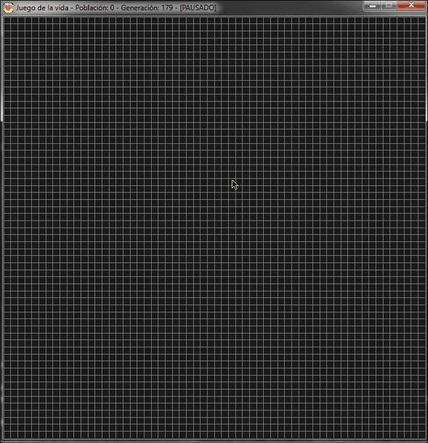

# GAME OF LIFE (TUTORIAL DotCSV)

## Contenidos

- [Fuente](#fuente)
- [Funcionamiento](#func)
- [Requisitos](#req)

## Fuente 

Proyecto proporcionado por DotCSV (canal: youtube.com/channel/UCy5znSnfMsDwaLlROnZ7Qbg).
Tutorial seguido: httpsPrograma el Juego de La Vida... en 10 MINUTOS! (video: youtube.com/watch?v=qPtKv9fSHZY)

## Funcionamiento 

Pequeño juego que recrea el juego diseñado por John Horton Conway (DEP, fallecido por coronavirus el 11 de abril de 2020 en Nueva Jersey) en 1970.

### Atajos de ratón y teclado
-Para dibujar use su click izquierdo.
-Para borrar use el click derecho.
-Para parar o reanudar el juego use el clcik central.
-La tecla "r" reanuda el juego.
-ESC finalizan la ejecución.

## Requisitos 

Versión de python utilizada: 3.8.2
Versión de pygame necesaria: 20.0.0 Dev6 (Cualquiera menor no será compatible)

